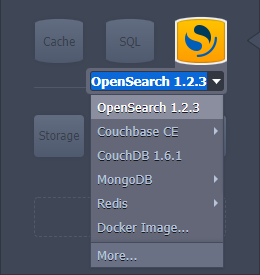
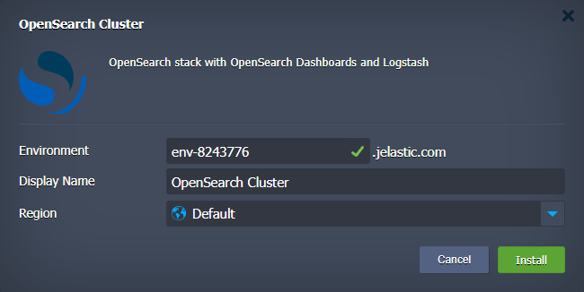
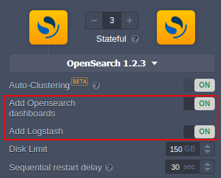

# OpenSearch Cluster

The **[OpenSearch Cluster](https://opensearch.org/)** is a community-driven, open-source search engine. It is most suitable for application search or log analytics cases, as it enables people to easily search, aggregate, view, and analyze data. OpenSearch provides a secure, high-quality search and analytics suite that can be easily modified and extended with additional functionality.

## OpenSearch Cluster Topology

The OpenSearch cluster consists of the following components:

- **OpenSearch** - a community-driven, open-source search engine (based on the Jelastic _OpenSearch_ certified template) that provides a distributed, multitenant-capable full-text search
- **OpenSearch Dashboards** (optional) - a stack for visualizing data that is stored inside the _OpenSearch_ nodes
- **Logstash** (optional) - additional node(s) for data processing
- **Beats** (optional) - separate add-on ([jelastic-jps/beats-jps-addon](https://github.com/jelastic-jps/beats-jps-addon)) for single-purpose data shippers that send data from the client nodes to _Logstash_ or _OpenSearch_

  

## Deployment to the Cloud

Click the **Deploy to Jelastic** button below, specify your email address within the widget, choose one of the [Jelastic Public Cloud](https://jelastic.cloud/) providers and click **Install**.

> **Note:** If you are already registered at Jelastic, you can deploy this cluster from the [topology wizard](https://docs.jelastic.com/setting-up-environment/) by selecting the **OpenSearch** stack at the _NoSQL database_ section:
>
> 
  

## Installation Process

Before the installation, the package provides a dialog to confirm the OpenSearch cluster creation and provide general environment details.

  

Here, you can specify:

- **_Environment_** - preferred environment name
- **_Display Name_** - any [alias](https://docs.jelastic.com/environment-aliases/) for the environment (optional)
- **_Region_** - select the [environment region](https://docs.jelastic.com/environment-regions/) (if several are available on the platform)

Click **Install** and wait a minute for the Jelastic PaaS to create and configure a single-node OpenSearch cluster. After installation, you can scale **_OpenSearch_** instances and add the **OpenSearch Dashboards** and **Logstash** nodes.

  

If needed, **Beats** data shippers can be added via the dedicated add-on.

For more information refer to the **[OpenSearch Cluster](https://docs.jelastic.com/opensearch-cluster/)** documentation.
