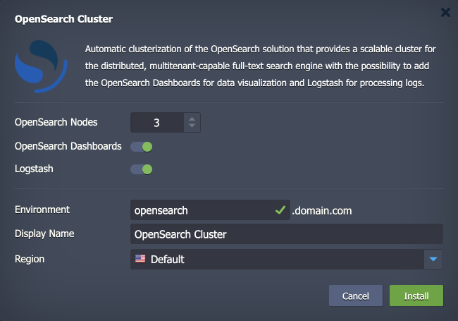
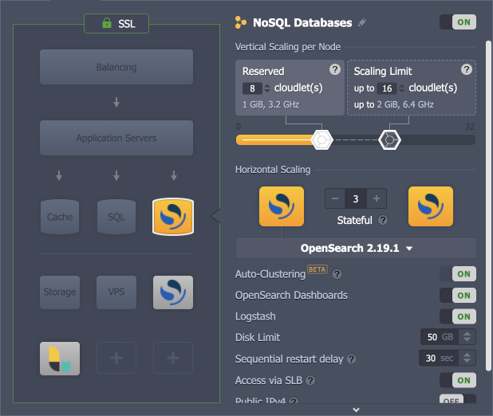

 

# OpenSearch Cluster

The **[OpenSearch Cluster](https://opensearch.org/)** is a community-driven, open-source search engine. It is most suitable for application search or log analytics cases, as it enables people to easily search, aggregate, view, and analyze data. OpenSearch provides a secure, high-quality search and analytics suite that can be easily modified and extended with additional functionality.

## OpenSearch Cluster Topology

The OpenSearch cluster consists of the following components:

- **OpenSearch** - a community-driven, open-source search engine (based on the Virtuozzo Application Platform *OpenSearch* certified template) that provides a distributed, multitenant-capable full-text search
- **OpenSearch Dashboards** (optional) - a stack for visualizing data that is stored inside the *OpenSearch* nodes
- **Logstash** (optional) - additional node(s) for data processing
- **Beats** (optional) - separate add-on ([jelastic-jps/beats-jps-addon](https://github.com/jelastic-jps/beats-jps-addon)) for single-purpose data shippers that send data from the client nodes to *Logstash* or *OpenSearch*

  

## Deployment to Cloud

To get your OpenSearch cluster solution, click the "**Deploy to Cloud**" button below, specify your email address within the widget, choose one of the [Virtuozzo Public Cloud Providers](https://www.virtuozzo.com/application-platform-partners/), and confirm by clicking **Install**.

> If you already have a Virtuozzo Application Platform (VAP) account, you can deploy this solution from the [topology wizard](https://www.virtuozzo.com/application-platform-docs/setting-up-environment/) by selecting the **OpenSearch** stack at the *NoSQL database* section or [import](https://www.virtuozzo.com/application-platform-docs/environment-import/) a manifest file from this repository.

## Installation Process

In the opened installation window at the VAP dashboard, you can configure the environment settings:

- ***OpenSearch Nodes*** - set the number of nodes in the cluster (1-10)
- ***OpenSearch Dashboards*** - enable to add the *OpenSearch Dashboards* node for data visualization
- ***Logstash*** - enable to add the *Logstash* node for data processing
- ***Environment*** - provide the preferred environment name
- ***Display Name*** - add any [alias](https://www.virtuozzo.com/application-platform-docs/environment-aliases/) for the environment
- ***Region*** - select the [environment region](https://www.virtuozzo.com/application-platform-docs/choosing-region/) (if several are available on the platform)

  

Click **Install** and wait a few minutes for the platform to create and configure your OpenSearch cluster.

The same can be configured (or adjusted after the installation) from the topology wizard:

  

If needed, **Beats** data shippers can be added via the dedicated add-on.

For more information refer to the **[OpenSearch Cluster](https://www.virtuozzo.com/application-platform-docs/opensearch-cluster/)** documentation.
